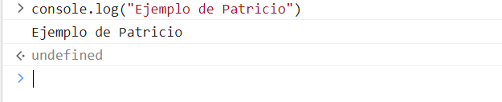

# Explorando los Fundamentos del Desarrollo Web en Entornos de Cliente
#### *Por Patricio Cifredo Reyes*
###### 2º DAW IES Rafael Alberti
###### DWEC - Proyecto 1
***

###### Fotografía con licencia de uso gratuito. Extraída de: https://images.pexels.com/photos/1181676/pexels-photo-1181676.jpeg?auto=compress&cs=tinysrgb&w=1260&h=750&dpr=2

***

## Índice

0. Introducción

1. Modelos de Programación en Entornos Cliente/Servidor

2. Mecanismos de Ejecución de Código en un Navegador Web. Capacidades y Limitaciones de Ejecución. Compatibilidad con Navegadores Web

3. Lenguajes de Programación en Entorno Cliente

4. Características de los Lenguajes de Script. Ventajas y Desventajas

5. Tecnologías y Lenguajes Asociados. Integración del Código con las Etiquetas HTML

6. Herramientas de Programación

7. Conclusiones y cierre

8. Referencias

***

## 0. Introducción

El presente trabajo tiene como finalidad servir de introducción al área del Desarrollo Web en entornos de clientes. Para ello, realizaremos una investigación y estudio de sus conceptos básicos, sus principales modelos y de las distintas tecnologías y herramientas asociadas.

## 1. Modelos de Programación en Entornos Cliente/Servidor

Según *García Escobedo (2012)*, los modelos de arquitecturas web establecen las relaciones existentes que se producen entre las diversas partes que componen las aplicaciones webs.

Por tanto, es lógico pensar en que existirán diversas formas de que estos elementos se interrelacionen. Y es que desde los orígenes del desarrolo web han ido surgiendo diversos enfoques y modelos.

Algunos de ellos son:

* Aplicaciones de página única (SPA): Como bien indica *Vergara (2023)* en el portal *itdo.com*, las aplicaciones de una sola página (SPA) son aplicaciones webs que cargan un solo archivo HTML que luego va actualizando  de forma dinámica a medida que se usa la aplicación.
    - Un ejemplo de esto podría ser *Youtube* ya que en todo momento la web se va actualizando sin que salgamos de ella. 

* Aplicaciones Web progresivas (PWA): Este tipo de webs utilizan distintas herramientas y tecnologías para replicar muchas de las funciones de aplicaciones nativas. Se pueden instalar en el dispositivo deseado al igual que estas pero se accede a ellas a través de un navegador (aunque no es necesaria conexión para usarlas). Por tanto las PWA: "Difuminan la barrera entre la web y las aplicaciones, pudiendo realizar tareas que generalmente solo las aplicaciones nativas podían llevar a cabo." *Ramírez (2018)*. 
    - *Facebook*, podría considerarse una PWA, ya que podemos usarlo desde el navegador y en su versión web puede recibir notificaciones como si de la app nativa se tratase.

* Modelo Vista Controlador: Esta arquitectura se basa en tres componentes:

  - a) un **Modelo**, es decir, el gestor de la información según un esquema lógico
  - b) una **Vista**, que es la información que se muestra al usuaria/o
  - c) un **Controlador**, que efectúa las peticiones al modelo según la interacción con la vista.

  > Una tecnología basada en este modelo es la herramienta *ASP.NET MVC Framework*


##### Figura 1. Diagrama del Modelo Vista Controlador. *García (2017) Copyright Miriam García/codingornot.com*


* Modelo Vista-modelo-de-Vista (MVVM): Al contrario que el modelo anterior este se basa en una separación de la interfaz gráfica de usuario respecto a la lógica y servicio de la aplicación. Como bien indican al respecto en un artículo de 2023 de *Microsoft Learn*,  esto facilita el desarrollo y mantenimiento de la web.

  - Algunos ejemplos de frameworks para el desarrollo de webs en modelo MVVM son *Angular, Aurelia, Jellyfish y Mvvmzero*.

Tamkbién existen los llamados modelos por "capas". El *departamento de Informática de la Universidad de Valladolid* hace diferencia entre:

* Modelo de 2 capas: El cliente se comunica directamente con la base de datos pero asume el grueso del procesamiento y de la aplicación en su equipo (fat client). Las peticiones al servidor se hacen mediante SQL, que devolverá la información pertinente. También existe un enfoque *fat server* en el que el servidor es el que tiene el mayor peso de la aplicación, pero es menos común.

* Modelo de 3 capas: Este modelo es más reciente que el de dos capas y consiste en implementar una capa intermedia entre el cliente y el servidor de la aplicación, residiendo la información y los datos de la misma en otros servidores diferentes.

## 2. Mecanismos de Ejecución de Código en un Navegador Web. Capacidades y Limitaciones de Ejecución. Compatibilidad con Navegadores Web

Para que un navegador ejecute Javascript, debemos escribir el mismo en un archivo con extensión *js*, el cuál enlazaremos a un documento *html* mediante la etiqueta *"script"*, que luego abriremos con el navegador de preferencia. 


##### Figura 2. Fotografía de un documento HTML con un archivo Javascript asociado mediante la etiqueta **script src=""**. Copyright de Gooding Hannah (2020), extraído de https://dev.to/hannahgooding/vs-code-shortcuts-and-tricks-that-i-wish-i-knew-sooner-3mcj

Aun así, es muy común que hoy en día los propios navegadores tengan integrados una consola para desarrolladoras y desarrolladores que permita usar y ejecutar JavaScript. Como se indica en la entrada *"Running JavaScript in the Browser Console"* (2023) de la web *codeacademy.com* , la consola permite ejecutar JS dentro de la página, modificar su estructura (DOM) y ver la información que el navegador recopile.

La mayoría de navegadores (*Chrome, firefox, Safari, Edge, Opera etc.*) son compatibles con alguna de las versiones de JavaScript. Aun así, la compatibilidad con ECMAScript 2024 (versión actual) y de sus APIs varia de uno a otro. Según *developer.mozilla.org* (2023), *Firefox* es uno de los navegadores con mejor implementación de las APIs de JavasCript, tanto en android como en PC. Aun así, este estudio podría estar sesgado al estar realizado por la propia compañía del navegador por lo que sus datos solo deben ser recogidos como informativos. 

Una posible solución a la hora de resolver problemas de compatibilidad JavaScript con el navegador deseado sería utilizar alguna herramienta de compilación/transpilación que nos "traduzca" nuestro script actual a la versión que necesitamos para nuestro navegador.

Según la web *byby.dev (2023)* algunas de las opciones más pupulares son *Babel*, *Build* o *TypeScript.*

Si nos encontramos en el la fase de diseño y desarrollo de la misma, quizá sería más sensato usar recursos de JavaScript que sepamos que son soportados por el navegador en el que se van a usar. Para ello existen herramientas online como *caniuse.com* que nos permite saber qué navegador acepta determinada función.
Aun así, la mejor opción siempre será emplear frameworks que faciliten el desarrollo de un diseño compatible con varios navegadores. Entre los frameworks de JavaScript más conocidos encontramos algunos como  *React JS*, *Vue JS* o *Angular JS*.

## 3. Lenguajes de Programación en Entorno Cliente


El catálogo de lenguajes de programación es prácticamente inabarcable, existiendo una gran variedad, normalmente cada uno de ellos enfocado a realizar cierto tipo de scripts o programas. Para el desarrollo web en el entorno del cliente algunos de los más conocidos y utilizados son:

* JavaScript: Desarrollado por Brendan Eich, trabajador en Netscape en la década de los noventa,  es uno de los lenguajes de desarrollo más extendidos. Es un lenguaje interpretado, de tipado débil y está principalmente enfocado a desarrollar las funcionalidades de las páginas webs dinámicas. *Ballerini* (2021) indica también: "Agrega movimiento a las páginas web, además de permitir el procesamiento y transformación de los datos enviados y recibidos". Por su parte, *Rodríguez* (2020) nos habla de como sus usos actuales se han ampliado e  incluyen el desarrollo de servidores, sistemas operativos, bases de datos o incluso el backend de una aplicación (a través de frameworks como Node.js). Su estandarización oficial es regulada por *TC39* y su última versión oficial es *ECMAScript 2024*. 

* TypeScript: Desarrollado por Microsoft en 2012, consiste en un lenguaje que extiende JavaScript mediante nueva sintaxis y herramientas, simplificándolo y por tanto haciendo más sencillo su uso. Al contrario que JavaScript, este lenguaje permite tipar las variables y debido a ser de mayor nivel que JavaScript, permite clarificar, simplificar y dar robustez a proyectos de gran envergadura. *Chacón* (2021) habla en su portal *profile.es* de la importancia de conocer este lenguaje ya que la mayoría de frameworks de desarrollo web lo utilizan.

* Swift: Este lenguaje desarrollado por *Apple* se caracteriza por estar únicamente orientado a desarrollo en entornos iOS y MAC.  Desde la web oficial de *Apple.com* hablan de algunas aplicaciones muy usadas y que están enteramente desarrolladas en este lenguaje tales cómo: *Airbnb, Linkedin o Kickstarter*. Se caracteriza principalmente por estar muy optimizado y por tanto ofrecer gran velocidad en las aplicaciones que lo utilicen para entornos de la marca *Apple*. A su vez, destaca sus herramientas de detección y control de errores. 

Otros lenguajes a mencionar son VBScript, que era utilizado para el desarrollo front-end en el navegador Internet Explorer. En el desarrollo web también son muy utilizados Python, Ruby, Dardo o PHP, sin embargo, no procederemos a detallarlos debido a estar más orientados a la parte back-end.


## 4. Características de los Lenguajes de Script. Ventajas y Desventajas

Basándonos en la información proporcionada por la web *Alegsa.com.ar* (2023) y en la web *Kinsta.com* por *Monus* (2023),podemos indicar que los lenguajes de Script se caracterizan principalmente por ser interpretados, de sintaxis simple y bastante flexibles en su tipado.

 Están enfocados en la creación de scripts (tareas específicas). Para ello estos lenguajes ofrecen funciones y librerias que simplifican la complejidad del código. Su uso es muy extendido en el desarrollo y mantenimiento de aplicaciones web, generando entornos dinámicos, automatizando procesos, manejando la información y conectándose con la base de datos.

Los lenguajes de script son más sencillos y claros que los lenguajes tradicionales, permitiendo estructurar fácilmente códigos que de otra forma serían muy complejos. Esto facilita el desarrollo de aplicaciones web de gran envergadura. En detrimento, el rendimiento y la velocidad de ejecución de los mismos es menor respecto a los tradicionales, debido a que los scripts suelen ser interpretados, mientras que los tradicionales suelen contar con su propio compilador y por tanto son de más bajo nivel. Aun así: "Los lenguajes de guiones tienen la ventaja de que no es necesario traducir el código fuente original para ser ejecutados, lo que aumenta su portabilidad" (*García Rincón, 2022*).

Una ventaja derivada de la simplicidad de los lenguajes de scripts es que reducen el número de errores, debido a la reducción de la sintaxis y al uso de funciones. 

Por otra parte, la compatibilidad difiere también entre ambos tipos de lenguajes. Los de guiones suelen tener más problemas de compatibilidad, ya que suelen ser exclusivos de una plataforma. En cambio, los lenguajes tradicionales no tienen este problema.

Cabe también mencionar, la incapacidad de los lenguajes de scripts para desarrollar aplicaciones independientes, debido a la la necesidad de usar un intérprete.

## 5. Tecnologías y Lenguajes Asociados. Integración del Código con las Etiquetas HTML

Además de los lenguajes de programación, existen otras tecnologías asociadas que son de vital importancia en el desarrollo web de la parte del cliente. Entre ellas encontramos:

* HTML: El lenguaje HTML, o por sus siglas *HyperText Markup Language*, es un lenguaje de marcas presente en la mayoría de aplicaciones webs que sirve para la elaboración de las mismas, permitiendo establecer su estructura y definir su contenido principal. Esto se consigue mediante el uso de etiquetas o marcas, que son palabras claves representadas entre los símbolos "<>". La versión actual es HTML5, que se lanzó en 2014 y que hace gran hincapié en la accesibilidad de las páginas webs mediante las etiquetas semánticas. "Las etiquetas HTML semánticas no solo son más fáciles de leer y comprender por los buscadores y desarrolladores web, sino que son más accesibles para los lectores con deficiencias visuales" (*Mendoza Castro, 2023*)


##### Figura 4. Ejemplo de código HTML. Copyright de *Servnet*. Fuente: https://www.servnet.mx/blog/codigo-html-que-es-y-todo-lo-que-debes-saber


* CSS: Si el HTML permite establecer la estructura de la aplicación web, CSS (*Cascading Style Sheet*) es el lenguaje de estilo que permite definir los valores estéticos y de posicionamiento del HTML. CSS permite personalizar en profundidad el diseño de la página, adecuándose a la mayoría de necesidades y preferencias. Su funcionamiento es bastante sencillo tal y cómo se explica en *Keepcoding.com (2023)*. Las reglas CSS son aplicadas a un documento por el propio navegador. Estas reglas se componen de selectores, que nos permiten escoger a que etiquetas HTML hay que aplicarles el estilo y por otra parte los valores del mismo. 


##### Figura 5. Ejemplo de norma CSS. Copyright de *Hubspot*. Fuente: https://blog.hubspot.es/website/que-es-css


Ahora que ya hemos hablado tanto de JS, como de HTML y CSS, veamos un pequeño ejemplo de cómo se integra y ejecuta un código JS.

Partimos de un pequeño script HTML:
```html
<!DOCTYPE html>
<html lang="en">
  <head>
    <meta charset="UTF-8">
     <meta name="autor" content="Patricio">
    <title>Ejemplo del trabajo</title>
  </head>
  <body>
    <script src="ejemplo.js"></script>
  </body>
  <footer></footer>
</html>
```


Como podemos observar, la etiqueta **script** es la que  enlaza el html con el archivo JavaScript mediante el atributo **src**.

El código del archivo JS enlazado "ejemplo.js" podría ser:

~~~
console.log("Ejemplo de Patricio");
~~~

Al abrir el archivo HTML con el navegador se ejecutaría directamente el archivo JavaScript asociado. 

Otra manera de ejecutar el código javascript es directamente en la consola de un navegador:



Por último, también podríamos utilizar el mismo código en un entorno de ejecución como *Node.js*.


## 6. Herramientas de Programación

Dentro del desarrollo web de la parte del cliente se suele trabajar con una serie de tecnologías y herramientas que ayudan a los desarrolladores y desarrolladoras a desplegar los medios necesarios para crear la aplicaciones y mantenerlas. Sus funciones suelen abarcar desde editores de texto, sistemas de control de versiones, bibliotecas o frameworks.

Algunas son estándar en el desarrollo de aplicaciones web y otras dependen de las preferencias personales de la persona que trabaje en el proyecto, pero entre las más comunes podemos encontrar:

* Visual Studio Code (VS Code): El VS Code es un editor de texto y código desarrollado por Microsoft que también cumple con funciones de IDE debido a la fácil integración de extensiones que amplian sus funcionalidades. Como queda reflejado en la página web oficial de *Microsoft* (2023), gracias a las extensiones el VS code permite trabajar con múltiples lenguajes, aunque está principalmente enfocado al desarrollo web y por tanto a TypeScript, Node JS y JavaScript.

* Github: Esta conocida plataforma basada en Git sirve a su vez como repositorio en la nube y como sistema de control de versiones de proyectos de desarrollo. "Una Versión de Control ayuda a los desarrolladores a llevar un registro y administrar cualquier cambio en el código del proyecto de software" (*Kinsta.com, 2020*). Es decir, aumenta la facilidad de colaboración y control en proyectos de equipos de desarrollo. 
En una entrada de este año, 2023, en su blog oficial, *Github.blog* se anunció que Github ya contaba con más de 100 millones de usuarios en todo el mundo.

* Chrome DevTools: La página oficial *developer.chrome.com* (2016) habla de Chrome DevTools como un conjunto de herramientas de desarrollo que están incluidas en el propio navegador. Por tanto, permite aumentar la velocidad en el desarrollo de aplicaciones webs ya que ayuda a editar y detectar problemas rápidamente. Para acceder a ellas solo es necesario seleccionar la opción "Inspeccionar" o "Inspeccionar código fuente" al clicar con el botón derecho en la interfaz de la web que deseemos o sobre la que estemos trabajando.
Mediante su consola podremos ejecutar JavaScript y con su opción *elements* podremos trabajar  directamente sobre el HTML y el CSS viendo los cambios en tiempo real. También podremos deputar código, crear y ejecutar snippets o incluso inspeccionar la actividad de red de la web.

* React.js: Esta librería JavaScript "permite crear interfaces de usuario para aplicaciones webs a partir de componentes" (*es.react.dev*). Una de los principales atractivos de esta librería es que permite a las usuarias y usuarios crear sus propios componentes, los cuáles pueden ser utilizados sin problema por otras personas. Está muy enfocada al desarrollo de SPA (aplicaciones de una sola página).

* Bootstrap: Es un framework de frontend basado en plantillas. Estas se basan de CSS, JS y HTML, simplificando y acelerando el desarrollo de la aplicación. *Deyimar* (2023) habla en su guía para principiantes sobre Bootstrap que este marco de trabajo está orientado a la creación de páginas web responsivas (adaptadas a todos los dispositivos).

* Angular: Esta herramienta de desarrollo *front-end* es un framework de TypeScript. Como bien refleja la web oficial *docs.angular.lat*, *Angular* permite la creación de PWA (páginas web progresivas), y por tanto multiplataforma, de forma rápida y sencilla a través de plantillas de código ya optimizadas.

Aunque nos hemos enfocado más en estas herramientas, existen muchísimas más en el desarrollo front-end, entre las que cabría también mecionar: *Materialize*, *JQuery*, *Lighthouse*, *NPM* y *Babel*.


## 7. Conclusiones y cierre

A lo largo de este trabajo hemos podido investigar e iniciarnos en el aprendizaje de conocimientos básicos sobre el desarrollo web del lado del cliente o "front-end", conociendo sus principales objetivos y las herramientas, lenguajes y tecnologías usadas para ello.

A pesar de ello, como hemos indicado anteriormente, se trata solo de una aproximación inicial que nos servirá como base, pero  hemos de seguir formandonos y adquiriendo conocimientos en el uso y los principios de esta extensa disciplina que tanta importancia tiene para la adquisición de nuestra competencia profesional.


## 8. Referencias

https://www.itdo.com/blog/pwa-vs-spa-cual-elegir/ **itdo.com**

https://www.xataka.com/basics/que-es-una-aplicacion-web-progresiva-o-pwa **Ramírez (2018)**

https://codingornot.com/mvc-modelo-vista-controlador-que-es-y-para-que-sirve **García (2017)**

https://learn.microsoft.com/es-es/dotnet/architecture/maui/mvvm **Microsoft Learn (2023)**

https://www.infor.uva.es/~fdiaz/sd/2005_06/doc/SD_TE02_20060305.pdf **Departamento de informática, Universidad de Valladolid**

https://www.codecademy.com/article/running-javascript-in-the-browser-console **codeacademy.com**

https://developer.mozilla.org/en-US/docs/Mozilla/Add-ons/WebExtensions/Browser_support_for_JavaScript_APIs **Mozilla.org**

https://byby.dev/js-transpilers **Byby.dev (2023)**

https://tc39.es/ecma262/multipage/ **TC39.es**

https://openwebinars.net/blog/para-que-sirve-javascript/ **Rodríguez 2020**

https://www.aluracursos.com/blog/html-css-javascript-cuales-son-las-diferencias **Ballerini (2021)**

https://profile.es/blog/que-es-typescript-vs-javascript/ **Chacón (2021)**

https://www.alegsa.com.ar/Dic/lenguaje_scripting.php#gsc.tab=0
**Alegsa.com.ar**

https://jairogarciarincon.com/clase/arquitecturas-y-herramientas-de-programacion-en-lado-servidor/lenguajes-de-programacion-y-herramientas **García (2022)**

https://kinsta.com/es/blog/lenguajes-script/ **Monus (2023)**

https://es.semrush.com/blog/html-semantico/ **Mendoza Castro (2023)**

https://visualstudio.microsoft.com/es/#:~:text=Descargar%20Visual%20Studio-,Visual%20Studio%20Code,casi%20cualquier%20lenguaje%20de%20programaci%C3%B3n. **Microsoft.com**

https://kinsta.com/es/base-de-conocimiento/que-es-github/ **Kinsta.com (2020)**

https://github.blog/2023-01-25-100-million-developers-and-counting/ **Github.blog (2023)**

https://developer.chrome.com/docs/devtools/overview/ **Developer.chrome.com (2016)**

https://es.react.dev/ **React.dev**

https://www.hostinger.es/tutoriales/que-es-bootstrap **Deyimar (2023)**

https://docs.angular.lat/ **Angular.lat**

https://www.apple.com/es/swift/ **Apple.com**

